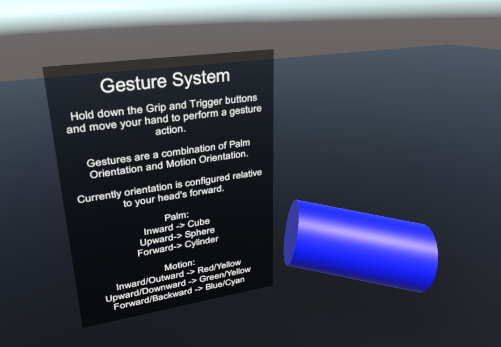

# VR Portfolio
This repository is a WIP collection of VR Game Development features, mechanics, and demonstrations.

It was made with Unity3D version 2021.3.17f1

## Gesture System
Scene: Gesture System Demo

Use a combination of palm direction and motion direction to perform Gestures. Actions can be assigned to a gesture, allowing the player to summon an interactable to their hand, or cast a spell.
